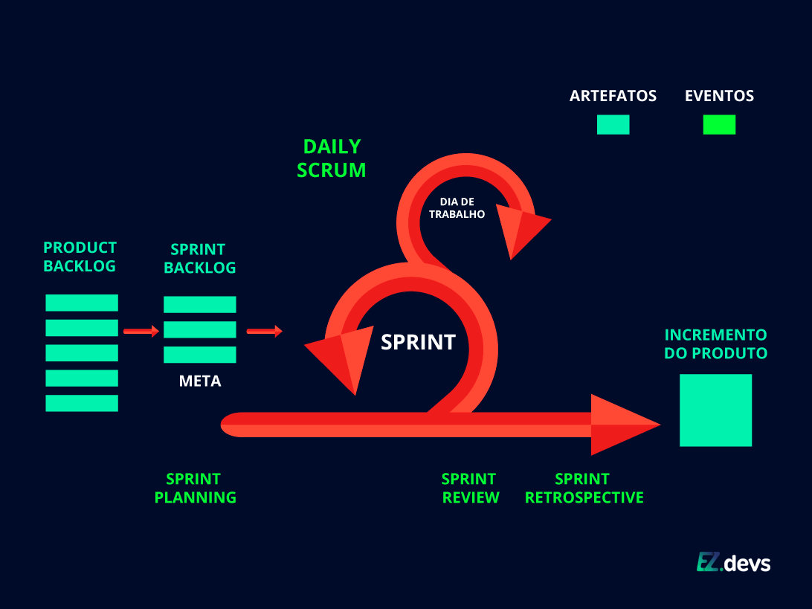
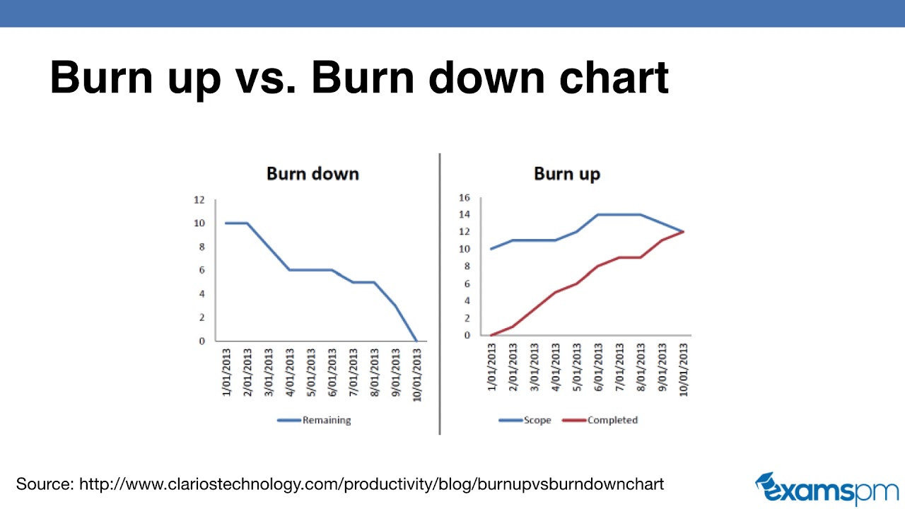
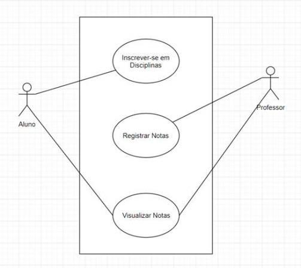

# 📌 Aula 02 - Introdução à Gestão de Projetos

Este documento contém um resumo dos principais conceitos abordados na **Aula 02 - Introdução à Gestão de Projetos**, incluindo metodologias ágeis, Scrum, Kanban, DevOps e gestão de requisitos. Ideal para referência rápida! 🚀

---

## 🏆 **1. Fundamentos de Gestão de Projetos**
### 📌 Definição de Projeto
- Um **esforço único, temporário e progressivo** para criar um produto, serviço ou resultado exclusivo.
- Possui **início, meio e fim** bem definidos.

### 📌 Tipos de Projetos
- **Curtos** (semanas) ou **longos** (anos).
- **Pequenos** (1-10 pessoas) ou **grandes** (milhares de pessoas).
- **Simples** ou **complexos**.

### 📌 Metodologias de Gestão de Projetos
- **Tradicional**: PMBOK (estruturado).
- **Ágil**: SCRUM, Kanban, XP.

---

## 🎯 **2. Metodologias Ágeis e Scrum**
### 📌 Time Scrum
- Equipes pequenas (idealmente **5-9 pessoas**).
- **Papéis no Scrum:**
  - **Product Owner (PO)**: Define requisitos.
  - **Scrum Master (SM)**: Facilita o processo.
  - **Desenvolvedores**: Implementam as soluções.

### 📌 Eventos do Scrum
- **Sprint**: Período de trabalho (1-4 semanas).
- **Sprint Planning**: Planejamento da sprint.
- **Daily**: Reunião diária de atualização (**15 min**).
- **Sprint Review**: Demonstração do trabalho concluído.
- **Sprint Retrospective**: Avaliação do processo.

### 📌 Artefatos do Scrum
| Artefato | O que é? |
|----------|---------|
| **Product Backlog** | Lista ordenada de requisitos |
| **Sprint Backlog** | Seleção de tarefas para a sprint |
| **Incremento** | Entregável ao final da sprint |

---

## 📝 **3. DevOps e Entrega Contínua**
### 📌 Conceitos
- **DevOps**: Cultura que une desenvolvimento e operações.
- **Integração Contínua (CI)**: Validação frequente do código.
- **Entrega Contínua (CD)**: Implementação rápida e automatizada.

### 📌 Monitoramento do Trabalho
| Métrica | O que monitora? |
|---------|----------------|
| **Burndown Chart** | Progresso da sprint |
| **Burnup Chart** | Evolução do projeto |

### 📌 Gestão de Requisitos e Casos de Uso
- **Formaliza o que o usuário pode ou não fazer.**
- **Definição clara das expectativas dos stakeholders.**

---

## 🏗 **4. Histórias de Usuário**
### 📌 Estrutura das Histórias de Usuário
- **Formato**: "Como [usuário], quero [ação], para [motivo]".
- **Exemplo**: "Como comprador, quero logar no site para iniciar o processo de compra".

### 📌 Princípios INVEST
| Princípio | Significado |
|-----------|------------|
| **Independentes** | Não dependem de outras histórias |
| **Negociáveis** | Flexíveis nos entregáveis |
| **Valorosas** | Contribuem para o objetivo final |
| **Estimáveis** | Podem ser mensuradas |
| **Small** | Pequenas o suficiente para serem entregues em uma sprint |
| **Testáveis** | Devem ser verificáveis |

### 📌 Refinamento da História
- Identificar usuários e suas necessidades.
- Definir ações e informações necessárias.
- Estabelecer controles e regras.
- Escolher a interface de interação.
- Garantir qualidade e segurança.

---

