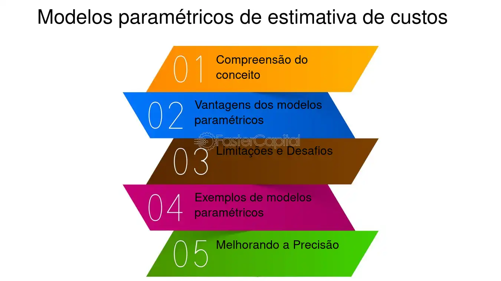

# 📌 Aula 03 - Estimativas de Esforço e Custo

Este documento contém um resumo dos principais conceitos abordados na **Aula 03**, incluindo **técnicas de estimativa de esforço**, **cálculo de prazo e custo de projetos** e o **modelo COCOMO**. 🚀

---

## 🏆 **1. Estimativas de Esforço no Desenvolvimento de Projetos**

As estimativas são essenciais para prever **tempo, custo e recursos necessários** para concluir um projeto com sucesso. Existem diferentes abordagens para realizar essas estimativas:

- **Estimativa Direta (Poker Scrum)** 🃏
- **Estimativa por Horas de Trabalho** ⏳
- **Modelos Paramétricos (COCOMO, PERT, Function Points, etc.)** 📊

📌 **Objetivo:** Melhorar a **precisão** e a **gestão de riscos** no projeto.

---

## 🎯 **2. Ponderação de Esforço com Poker Scrum**

O **Poker Scrum** é uma técnica colaborativa para estimar esforço, garantindo que toda a equipe participe da decisão. Funciona assim:

1. **Reunião de Estimativa** 🎯 → A equipe e o Product Owner se reúnem para definir o esforço das tarefas.
2. **Uso de Cartas** 🃏 → Cada membro escolhe uma carta com valores como 1, 2, 3, 5, 8, 13, 20, etc.
3. **Discussão e Votação** 🗣️ → Se houver grande variação nas estimativas, a equipe discute e refaz a votação até chegar a um consenso.
4. **Registro das Estimativas** 📌 → O valor final é documentado na ferramenta de gestão do projeto.

📌 **Vantagens do Poker Scrum:**
✔️ Reduz influência de opiniões individuais.  
✔️ Incentiva colaboração e consenso.  
✔️ Facilita a compreensão das tarefas pela equipe.

---

## ⏳ **3. Estimativa Baseada em Horas de Trabalho**

Outra abordagem comum é **estimar diretamente o esforço em horas de trabalho**:

1. **Dividir as tarefas** em subtarefas menores.
2. **Cada membro estima** individualmente o tempo necessário para cada subtarefa.
3. **As estimativas são discutidas** e ajustadas para alinhar expectativas.
4. **Os valores finais são consolidados** e registrados.
5. **O progresso real é acompanhado** e atualizado conforme necessário.

📌 **Importante:** Esta abordagem funciona bem quando há **dados históricos confiáveis** sobre produtividade.

---

## 📊 **4. Modelos Paramétricos de Estimativa**

Os modelos paramétricos utilizam fórmulas matemáticas e dados históricos para calcular **esforço, prazo e custo** de um projeto. Os mais comuns são:

- **COCOMO (Constructive Cost Model)** → Estima esforço com base no tamanho do código-fonte (KLoC - mil linhas de código).
- **Function Points** → Mede funcionalidade do sistema e converte em esforço estimado.
- **PERT (Program Evaluation and Review Technique)** → Calcula tempo com base em cenários otimista, pessimista e mais provável.

---

## 🔢 **5. Modelo COCOMO**

O **COCOMO** é um dos modelos mais usados para estimar esforço e custo em projetos de software. Ele utiliza a fórmula:

📌 **Fórmula do COCOMO:**  
**E = a × (KLoC)^b × EAF**  

Onde:
- **E** = Esforço em pessoas-mês (PM)
- **KLoC** = Linhas de código (em milhares)
- **EAF** = Fator de ajuste de esforço
- **a** e **b** = Constantes baseadas no tipo de projeto

📌 **Tipos de Projetos no COCOMO:**
| Tipo de Projeto | Características |
|---------------|-----------------|
| **Orgânico** | Pequenas equipes, requisitos claros e pouco complexos. |
| **Semi-Detached** | Complexidade intermediária, equipe mista (experiente e iniciante). |
| **Embedded** | Sistemas altamente complexos e com muitas restrições. |

📌 **Exemplo de cálculo:**  
Um site de e-commerce simples, com **40 KLoC** (40.000 linhas de código), desenvolvido por uma empresa experiente:

- **Constantes:** `a = 3.2`, `b = 1.05`
- **Cálculo do esforço:**
  
  **E = 3.2 × (40)^1.05 × 0.598**
  **E = 92.05 PM (pessoas-mês)**

- **Duração do projeto:**  
  **D = 2.5 × E^0.38**
  **D = 13.94 meses**

📌 **Cálculo da produtividade:**  
**P = E / D = 92.05 / 13.94 = 6.6 pessoas por mês**

---

## ✅ **6. Resumo Final**

| Técnica | Descrição |
|----------|-----------|
| **Poker Scrum** | Técnica de estimativa colaborativa usando cartas e consenso. |
| **Estimativa por Horas** | Definição de tempo com base em experiência da equipe. |
| **COCOMO** | Modelo baseado em tamanho do código e fatores ajustáveis. |
| **PERT** | Cálculo de tempo considerando cenários otimista e pessimista. |
| **Function Points** | Mede funcionalidades do sistema e converte em esforço estimado. |

---

🔹 **Dica Extra:**  
Se quiser melhorar suas estimativas, utilize **dados históricos** e combine diferentes métodos para obter previsões mais confiáveis. 🚀

Se precisar de ajustes, me avise! 🔥
